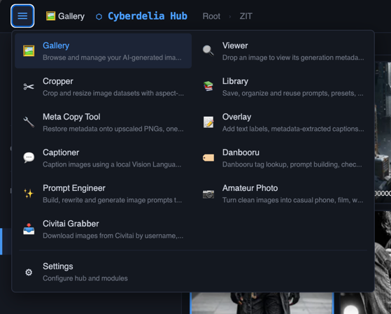
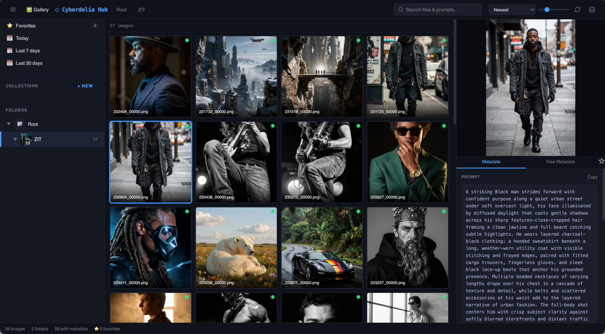
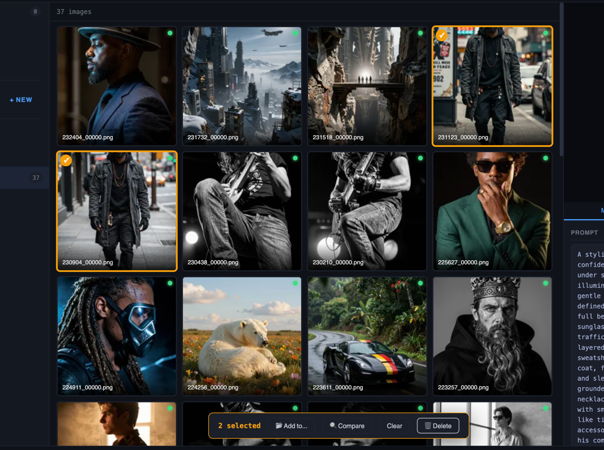

# CyberHub: User Manual

A local-first command center for AI image creators. The starter includes Gallery and lets you add only the independent tools you want through Module Manager.

---

## Table of contents

- [What is CyberHub?](#what-is-cyberhub)
- [Installation](#installation)
- [First launch](#first-launch)
- [The interface at a glance](#the-interface-at-a-glance)
- [Modules](#modules)
  - [Module Manager](#module-manager)
  - [Gallery](#gallery)
  - [Auto Tagger](#auto-tagger)
  - [Viewer](#viewer)
  - [LoRA Info](#lora-info)
  - [Library](#library)
  - [Compare](#compare)
  - [Captioner](#captioner)
  - [Prompt Engineer](#prompt-engineer)
  - [Danbooru](#danbooru)
  - [Civitai Grabber](#civitai-grabber)
  - [Civitai Browser](#civitai-browser)
  - [Cropper](#cropper)
  - [Overlay](#overlay)
  - [Amateur Photo](#amateur-photo)
  - [Upscaler](#upscaler)
  - [Meta Copy Tool](#meta-copy-tool)
  - [Settings](#settings)
- [Common workflows](#common-workflows)
- [Going fully offline](#going-fully-offline)
- [Running on your home network](#running-on-your-home-network)
- [Troubleshooting](#troubleshooting)
- [Tips, tricks and shortcuts](#tips-tricks-and-shortcuts)
- [Where things live on disk](#where-things-live-on-disk)
- [Reset and clean state](#reset-and-clean-state)

---

## What is CyberHub?

CyberHub is a portable application that gives you one place to organize, view, prompt-engineer and curate AI-generated images. Everything runs locally in your browser through a small server bundled with the app. No accounts, no cloud, no telemetry.

It's built for people who:

- Generate a lot of images with Stable Diffusion, Forge, ComfyUI or similar tools
- Want to read and search the prompt metadata baked into PNGs
- Need a place to keep working prompts, captioner presets and Danbooru tag lists
- Auto-caption datasets with a local Vision Language Model (LM Studio)
- Download reference images from Civitai by username, model or tag
- Compare A/B test images to understand what changed between renders

The hub is **modular**. The starter contains Core, Settings, Module Manager and
Gallery. Gallery is also independently versioned, while all other tools can be
installed, updated, disabled or removed separately.

CyberHub has one edition, so there is no Lite or Full choice. Open Module
Manager and manually load the current catalog when you want to add a stable,
beta or community module. CyberHub never checks for updates in the background.

---

## Installation

### Requirements

- **Python 3.10+** (3.11 or 3.12 recommended)
- **Windows, macOS or Linux**
- A modern browser (Chrome, Firefox, Edge, or anything Chromium-based)
- Optional: **Docker** instead of a host Python installation
- Optional: **LM Studio** if you want to use the Captioner or Prompt Engineer

### Windows

1. Download the CyberHub ZIP and extract it to its own folder, for example
   `D:\CyberHub`.
2. Double-click `start.bat`.

### macOS

1. Download and extract the CyberHub ZIP, for example to `~/CyberHub`.
2. Open Terminal in the extracted folder.
3. Run:

   ```bash
   ./start.sh
   ```

### Linux

1. Download and extract the CyberHub ZIP, for example to `~/CyberHub`.
2. Open a terminal in the extracted folder.
3. On Debian or Ubuntu, make sure Python and its virtual-environment package are
   installed:

   ```bash
   sudo apt update
   sudo apt install python3 python3-venv python3-pip
   ```

4. Start CyberHub with:

   ```bash
   bash start.sh
   ```

Using `bash start.sh` avoids executable-permission problems caused by some ZIP
extractors. You can alternatively run `chmod +x start.sh` once and then use
`./start.sh`.

The first launch automatically:

- Creates a `.venv/` virtual environment inside the folder
- Installs the dependencies from `requirements.txt`
- Starts the server on `http://localhost:8899`
- Opens your default browser

### What gets installed

```
Pillow                  image reading, thumbnails, format conversion
send2trash              recoverable file deletion (recommended)
requests                Civitai API + general HTTP
numpy + opencv          only used by Amateur Photo module (optional)
onnxruntime             only used by Upscaler module (optional)
```

If you don't need Amateur Photo or Upscaler, you can skip their optional dependencies. The module will report "Not ready" and the rest of the hub works fine.

### Manual Linux installation

Use this only when `start.sh` cannot complete the setup:

```bash
python3 -m venv .venv
source .venv/bin/activate
python -m pip install --upgrade pip
python -m pip install -r requirements.txt
python hub.py
```

Open `http://127.0.0.1:8899` in a browser. Press `Ctrl+C` in the terminal to stop
CyberHub. On later launches, either run `bash start.sh` or activate the existing
environment and start the Hub again:

```bash
source .venv/bin/activate
python hub.py
```

The filename is `hub.py`, not `hub.ph`. If `python3 -m venv .venv` fails on
Debian/Ubuntu, install `python3-venv` as shown above. If you prefer to create
`venv/` instead of `.venv/`, `start.sh` will also recognize and reuse it.

After you install Upscaler or Auto Tagger, the launcher adds a CPU ONNX Runtime
fallback only when no CPU or GPU runtime is already available. For a completely
manual installation, add:

```bash
python -m pip install "onnxruntime>=1.17"
```

On Windows, manual environment commands use `.venv\Scripts\` instead of
`.venv/bin/`.

### Docker install

Docker can run CyberHub without installing Python on the host:

```bash
docker compose up --build -d
docker compose logs cyberhub
```

Open `http://localhost:8899`. On first launch, copy the access token from the
container log and enter it on the authentication page. Authentication remains
enabled because the browser reaches CyberHub through Docker's network bridge.

Before starting, edit `docker-compose.yml` and add one or more Gallery mounts:

```yaml
volumes:
  - cyberhub_data:/app/data
  - /path/to/your/images:/images/output:ro
```

Then add `/images/output` under Settings -> Gallery. Authenticated users may use
the folder picker inside the container. A read-only (`:ro`) mount prevents
CyberHub from deleting or changing source images; use `:rw` only when those
actions are intentional.

The default Compose port is bound to `127.0.0.1`, so it is available only on the
Docker host. For trusted LAN access, change it to `8899:8899` and keep token
authentication enabled. Do not use `--no-auth` on an externally reachable port.

Docker persists settings, `cyberdelia.db`, thumbnails and Library attachments in
the `cyberhub_data` volume. The optional Auto Tagger model has its own persistent
volume. Stop and remove the container without deleting volumes to retain this
data:

```bash
docker compose down
```

---

## First launch

On the first run you'll see the **Gallery** with no images. That's normal because the hub doesn't know yet where your image folders are.

1. Click **Settings** in the top bar (gear icon).
2. Find the **Gallery folders** section.
3. Add one or more folders where your AI images live. You can have multiple. Outputs from Forge, ComfyUI, Civitai grabber, anything.
4. Click **Restart now**. The hub re-indexes and your images appear in the Gallery.

The hub keeps a SQLite database (`cyberdelia.db` next to `hub.py` for native
installs) that remembers metadata, Library cards, collections and favorites.
Thumbnails are stored in `.thumbs/`. Docker stores both in its persistent data
volume. Your image files are never moved or modified unless you explicitly use
an editing or delete action on a writable folder.

---

## The interface at a glance



Every page shares the same top bar:

```
[menu]   [active module icon + name]    CyberHub     [Settings]
```

- **Hamburger menu**: full module list, even modules hidden from the top bar
- **Top bar buttons**: modules with `show_in_tabs=True` (most of them)
- **CyberHub**: clicking the title takes you to the Gallery
- **Settings button**: Settings

Modules are loaded automatically from `modules/<name>/__init__.py`. Disabling one in Settings takes effect after a restart.

---

## Modules

### Module Manager

Module Manager controls the optional parts of CyberHub. The starter already
contains Gallery; all other user-facing modules are separate packages.
Open it from the bottom row of the module menu: Settings is on the left and
Module Manager is on the right.

- **Installed** shows modules currently present in the CyberHub folder.
- **Official** shows stable modules maintained by Cyberdelia.
- **Beta** shows modules still under active development.
- **Community** is reserved for third-party modules accepted into the catalog.
- **Check for updates** is the only action that contacts the GitHub registry.
  Opening CyberHub does not perform a check.
- **Install** and **Update** download one verified module package, check its
  repository, size and SHA-256 checksum, and create a backup before replacing
  files.
- **Remove** deletes only files registered as owned by that module. Module
  settings and user data are preserved, and a backup is retained.

Settings and Module Manager are protected system modules. They cannot be
disabled or removed. Python modules contain executable code, so community
modules show an additional warning before installation.

After installing, updating or removing a module, click **Restart CyberHub** in
Module Manager. The button waits until module operations finish. Confirm the
restart when your other tasks are finished; the page reconnects automatically.
The restart notice remains available when you leave and return to Module Manager.

### Gallery



The main view. Browse all images in your configured folders.

**What it does**

- Quickly discovers filenames and folders so new images appear in the grid
  without waiting for metadata extraction
- Processes metadata, dimensions, thumbnails, tags, search data and model
  grouping afterwards in the background
- Shows thumbnails in a grid (auto-generated, stored under `.thumbs/`)
- Reads A1111/Forge/ComfyUI metadata from PNGs and exposes it for search and display
- Supports collections (manual groupings), favorites, and a recycle-bin-aware delete

**Background processing**

- The status bar at the bottom shows the active folder scan first, followed by
  background image processing.
- Background work can be paused and resumed from the status bar.
- Opening an image or requesting its thumbnail moves that image to the front of
  the processing queue.
- Gallery watches configured folders for targeted file changes by default. A new,
  changed or removed image is updated directly instead of triggering a complete
  library rescan. This can be disabled in Settings -> Gallery.
- Large existing databases may show a one-time model-information pass after the
  update. This reads stored metadata and does not reopen the original images.

**Folder tree** (left sidebar)

- Click a folder to filter to just that subfolder
- The "All" view shows everything across configured roots
- Folders without images are hidden, while parent folders that contain useful
  image subfolders remain visible

**Search bar**

- Free-text search across prompt content, filename, model name and other metadata
- Use the metadata dropdown in the Gallery top bar to show all images, only
  images with generation metadata, or only successfully processed images
  without generation metadata. The last view is useful for reviewing and safely
  cleaning files that show **No generation metadata found**.
- Searches use a SQLite full-text index, so a fragment like `illustr` matches `Illustrious` without scanning every PNG metadata blob
- Checkpoint names joined by `_` `.` `-` are also split into searchable words, so a fragment in the **middle** of a name finds it too — e.g. searching `zit` finds images made with `CyberRealistic_zit_v5.0`. (After upgrading a large existing gallery, run **Settings → Maintenance → Rebuild search** once so older images pick up this.)

**Selection and bulk actions**



- **Ctrl/Cmd+Click** an image to toggle it in multi-select.
- **Shift+Click** to range-select from the active image.
- **Arrow keys** move the active image through the grid.
- **Shift+Arrow keys** extend or shrink a keyboard range selection. For example,
  `Shift+Right` expands the range and `Shift+Left` shrinks it again.
- **Ctrl/Cmd+A** selects all images on the current page.
- **Delete** moves the selected image(s) to the system trash. Delete also works
  in fullscreen image view.
- The action bar at the bottom appears when images are selected.
- From there you can add to a collection, compare (2-4 images), or delete.

Deletion is recoverable when `send2trash` is installed: files are moved to the
system trash, not permanently removed. Settings -> Gallery includes **Skip delete
confirmation** for users who prefer one-key deletion; even with that enabled,
files still go to the system trash. Bulk deletion shows live progress and
reloads the active Gallery view afterwards, including page correction when the
old last page no longer exists.

**Right-side panel: image metadata**

- Click any image to open the metadata panel
- **File Info** shows the selected image's folder and complete server-side file
  path. Use **Copy** next to either value when you need to locate the source file.
- See positive prompt, negative prompt, sampler, steps, CFG, seed, model, LoRAs (Model hash sits directly under Model, and VAE hash under VAE, so each value stays next to its name)
- **Collapse / pin**: the panel is collapsed by default to give the grid more room, and slides open automatically when you click an image. Use the toggle button in the top bar to show/hide it manually, or the **pin** button in the panel header to keep it permanently open. The pinned state is remembered across sessions (stored in your browser).
- When the image has metadata, a **Target dropdown** and **Save to Prompt Library** button appear. Pick a target (Z-Image, SDXL, Flux, etc.) and the card lands in your Library with the prompt, the image as an attachment, and the model/sampler/steps captured automatically.

**Re-indexing**

- The filesystem watcher normally picks up file changes automatically. A manual
  **Re-index** button (top bar) remains available for disconnected drives,
  missed filesystem events or a full check. Periodic background re-indexing is
  off by default and can be enabled in Settings -> Gallery.
- **Generate all thumbnails** lives in Settings -> Maintenance. Background
  processing now creates thumbnails automatically, while this action remains
  useful when you want to pre-build every missing thumbnail immediately.
- Re-index also cleans up folder roots that were removed from Settings. After
  deleting all images in a folder, Gallery removes empty folder records from the
sidebar automatically.

---

### Auto Tagger

Auto Tagger is an optional module that analyzes Gallery images locally with
the WD EVA02-Large Tagger v3 ONNX model. It adds visual descriptions such as
`portrait`, `blue_hair`, `outdoors`, character names and a rating classification
even when an image has little or no embedded generation metadata.

**First use**

1. Open **Auto Tagger** and click **Install model**. The pinned model and tag list
   are downloaded into `resources/auto_tagger/`; they are not part of the
   CyberHub release ZIP.
2. Leave the **Balanced** preset selected initially. CPU works everywhere;
   Settings -> Auto Tagger can select CoreML, CUDA or DirectML when available.
   Changing preset or custom thresholds marks earlier results as stale; use
   **Tag all untagged** to refresh only the affected tag revision.
   On NVIDIA systems, stop CyberHub and install the CUDA runtime from the
   CyberHub folder:

   ```bat
   .venv\Scripts\python.exe -m pip uninstall -y onnxruntime onnxruntime-gpu
   .venv\Scripts\python.exe -m pip install --upgrade "onnxruntime-gpu[cuda,cudnn]"
   ```

   Restart CyberHub afterwards. The Runtime card must then show **CUDA**;
   Azure is not a local NVIDIA provider.
   If CUDA is shown but the first inference reports a missing
   `cudnn_engines_tensor_ir64_9.dll`, repair the cuDNN wheel and restart:

   ```bat
   .venv\Scripts\python.exe -m pip install --upgrade --force-reinstall nvidia-cudnn-cu12
   ```

   Auto Tagger performs a short provider warm-up before a job. An incomplete CUDA
   setup stops there instead of silently running a large queue on CPU.
   **Inference batch size** can remain `0` for automatic selection: CUDA uses 4,
   CoreML/DirectML use 2 and CPU uses 1. Lower it when GPU memory is limited.
   When the server reads originals from a NAS or mapped network drive, select
   **Gallery thumbnail (fast)** under **Tagging image source**. Cached Gallery
   thumbnails preserve the full composition; the Gallery cards crop them only
   for display. Fine-detail tag accuracy can be slightly lower in fast mode.
3. Click **Tag all untagged**. Progress, processed count, failures and estimated
   time remaining are shown on the module page. Speed and ETA appear after the
   first inference warm-up. The job can be paused or cancelled.
   To process a smaller section, choose an indexed **Gallery folder** and use
   **Tag folder** or **Re-tag folder**. Folder jobs include all subfolders. The
   most recently opened Gallery folder is selected automatically when available.

**Using tags in Gallery**

- Click the tag button in the Gallery top bar to search visual tags. Suggestions
  appear as you type. Separate multiple tags with commas; all selected tags must
  match, for example `portrait, blue_hair`.
- In an image's **AI Tags** tab, click one or more tag chips and choose
  **Filter selected**. Selected tags are combined with AND, so selecting
  `fur trim` and `nose` shows only images containing both tags.
- Selecting images adds an **AI Tag** bulk action. The tag menu can also process
  the current folder, and tags in the image metadata panel can be copied,
  filtered or refreshed.
- The module page lists the most common tags; clicking one opens its Gallery
  results directly.
- Tags and confidence scores are stored in the existing Gallery database. Images
  stay on the local machine; only the model installation contacts Hugging Face.
- **Automatically tag newly indexed images** is optional and off by default.
  Existing Gallery behavior is unchanged when Auto Tagger is disabled or absent.

Auto Tagger also supplies on-demand WD tags to Captioner's optional **SDXL WD
Hybrid** script. These interactive results are used only for the active caption
request and are not written to the Gallery database. Interactive and background
tagging run one at a time so they do not compete for ONNX provider memory.

The tagger uses the full composition rather than the square crop shown by Gallery
cards. For extremely large images it may use Gallery's aspect-preserving cached
thumbnail to avoid excessive memory use; the metadata panel indicates this.

---

### Viewer

A single-purpose page. Drop a PNG and see its metadata.

Useful when someone sends you an image and you want to know what prompt produced it without adding the whole folder to your gallery. Drag and drop, paste, or browse via the compact drop bar at the top. The result opens in a **two-column layout** — the preview (sticky) on the left, the parsed metadata on the right — showing prompt, negative, settings, and recognized LoRAs in a clean read-only view. As in the Gallery, Model hash is shown right under Model and VAE hash under VAE. On narrow screens the two columns stack.

---

### LoRA Info

A local, read-only inspector for LoRA files in the Safetensors format. It reads
the JSON header and tensor descriptions but never loads model weights or runs
code from the file. Open **LoRA Info** from the Modules menu. Like other
CyberHub modules, it can be enabled or disabled from the Modules section in
Settings; restart CyberHub after changing that switch.

Choose the source that matches where the file lives:

- **This computer**: choose or drop a `.safetensors` file from the computer
  running the browser. The browser reads only the Safetensors header and sends
  that metadata to CyberHub. The full LoRA is not uploaded, which keeps this
  practical when CyberHub runs on another PC over the network.
- **CyberHub computer**: use the built-in server file browser to select a LoRA
  on the PC running CyberHub. Its location bar shows Windows drive letters,
  macOS volumes, Linux mount locations and the Hub user's home folder directly.
  The Hub reads the header itself and can also calculate the full SHA-256 and
  AutoV2 hash incrementally without loading the complete file into memory.

The result includes the readable model and base-model details, network rank and
alpha, optimizer and learning rates, epochs and steps, training timestamps,
aggregated Kohya tag frequencies, tensor groups and datatypes, stored hashes and
a searchable raw-metadata table. Metadata can be copied or saved as JSON. LoRA
trainer metadata that contains the non-standard `Infinity`, `-Infinity` or
`NaN` constants remains readable and is exported as valid JSON strings.

Only `.safetensors` is supported. Legacy `.ckpt` and `.pt` files are not opened,
because reading their pickle-based contents can execute untrusted code. A
browser-selected file does not currently receive a full SHA-256 hash,
because hashing it would require reading the complete model in the browser.

---

### Library

<!-- SCREENSHOT (06-library-grid.png): The Library card grid with a mix of types (generation, captioner, snippet). One card opened to show its detail view with prompt, target tag, and attachment thumbnail. -->

The prompt vault. Save anything text-shaped that you'll want to reuse later.

**Card types**

- **Generation**: a positive prompt you want to keep, often with the source image attached
- **Captioner**: a system prompt for the Captioner module (your VL instructions)
- **Snippet**: small reusable text blocks (tag combos, character descriptions, style snippets)
- **Note**: free-form notes

**Targets**

Each card has a target so you can filter by model family: `general`, `sdxl`, `zit` (Z-Image), `flux`, `illustrious`, `pony`, `llm`, `suno`.

**Tags**

Free-form, comma-separated. Used for additional filtering.

**Attachments**

A card can have one attachment: an image, PDF or Markdown file. Images are useful for source generations and visual references; PDFs and Markdown files are useful for prompting guides, notes or model-specific reference material.

Attachments are content-addressed by SHA-256, so saving the same file twice only stores it once on disk. Image thumbnails are auto-generated for the card view. PDF and Markdown attachments show as compact document chips with open/download actions.

**Search and filters**

- Filter by type, target, or tag
- Free-text search across title, content, notes
- Pagination. The page shows 200 cards at a time with a "Load more" button when there's more

**Import / export**

- **Export ZIP**: bundles `library.json` plus all referenced attachments into a portable archive
- **Import**: accepts either a ZIP from another hub or just a `library.json`
- Imports are atomic. If anything in the ZIP is invalid, nothing gets written and no half-imported attachments are left behind
- A 500 MB uncompressed cap protects against zip-bombs

**Keyboard shortcuts**

- `N`: new card
- `/`: focus search
- `Esc`: close the editor / clear search

---

### Compare

<!-- SCREENSHOT (03-compare-prompt-diff.png): Compare view with 2 or 3 images side by side, each with its own color-coded border. Below, the Prompt tab is active, showing shared / partial / unique tag sections with the colored highlights. -->

Side-by-side comparison of 2-4 images with metadata diff.

**How to open**

From the Gallery, Ctrl+Click 2-4 images so they're multi-selected, then click **🔍 Compare** in the action bar.

**What you see**

- Each image gets its own color-coded panel (consistent throughout the diff so you can tell which value comes from which image)
- Two tabs:
  - **Settings**: diffs Steps, Sampler, CFG scale, Seed, Model, Size, LoRA hashes. Values either match (shared) or differ (per image)
  - **Prompt**: splits the prompt by comma and categorizes each tag as shared (in all images), partial (in some), or unique (in only one). Hovering a partial tag highlights which images contain it.

**Use cases**

- "Why does the second image look more saturated?" The Settings tab shows you changed CFG from 5 to 7
- "What's different between my two LoRA test runs?" The Settings tab shows different Model hashes
- "Which tag in my prompt produced that detail?" The Prompt tab shows what's unique to that image

The Compare page is not in the top bar by design. It's always opened from a Gallery selection.

---

### Captioner

<!-- SCREENSHOT (04-captioner-queue.png): The Captioner with 3-4 images in the queue, each showing its generated caption next to the thumbnail. The preset dropdown is visible at the top of the sidebar (showing one selected). -->

Auto-caption images with a local Vision Language Model running in LM Studio.

**Prerequisites**

- LM Studio installed and running with a vision-capable model loaded (for example Qwen3-VL-8B)
- LM Studio's local server enabled (default: `localhost:1234`)

**How it works**

1. Check the **Connection** block in the left sidebar
2. Set the API URL and optionally the model or generation overrides, then click
   **Save** or **Detect model**
3. Drag images into the drop zone, click to browse, or use **Open folder**
4. Pick a built-in Vision script or one of your saved presets
5. Optionally tweak the active instruction in the inline editor
6. Click **Run all** to caption every queued image
7. Captions appear next to each thumbnail; the queue has its own scrollbar so
   the progress and batch buttons remain visible with large datasets

**Connection**

Captioner exposes its LM Studio / OpenAI-compatible connection directly in the module sidebar. Captioner no longer has a separate block in Settings; connection and Vision scripts are managed from the Captioner page itself.

Like Prompt Engineer, Captioner first connects directly from the browser. If
that is unavailable, it automatically retries through the CyberHub server. This
supports both LM Studio on the computer running your browser and LM Studio next
to CyberHub on a separate server.

- **API URL**: usually `http://localhost:1234` for LM Studio on the same computer.
  Addresses with or without `/v1` are accepted, including custom ports such as
  `http://localhost:8000`.
- With browser-direct access, `localhost` refers to the computer displaying
  CyberHub. For LM Studio on another computer, enter that computer's LAN address
  and enable network access in LM Studio.
- **Model**: leave empty to let the backend use its configured default, or click **Detect model**
- **Temperature, Top P, Max tokens, Top K and Presence penalty** are optional
  overrides. Empty fields are omitted from the request so LM Studio uses its own
  configured values. **Clear generation overrides** empties and saves all five.

**Vision scripts and presets**

<!-- SCREENSHOT (09-captioner-preset-workflow.png): Sidebar zoom showing preset dropdown open with multiple captioner presets, the editor textarea below it with content, and the Update + Save as preset buttons visible. -->

The dropdown starts with built-in Vision scripts for common caption styles, followed by your saved Library cards with `type=captioner`. Switching scripts immediately changes what instruction the VL model receives on the next caption run.

- **Built-in scripts**: LoRA-training prompts for Z-Image, Flux and SDXL, plus
  general dataset captions and plain visual descriptions
- **SDXL WD Hybrid**: shown when the optional Auto Tagger module is installed.
  It first creates WD EVA02-Large tags locally and then asks the vision model to
  refine them while also inspecting the original image. Install the WD model on
  the Auto Tagger page before using this script.
- **WD score**: minimum confidence for tags passed to the vision model. `0.40`
  is a useful starting point; lower values add more tags and more false positives.
- **Constant WD tags**: comma-separated WD tag names such as
  `blonde_hair, blue_eyes`. Matching tags are removed so the trigger token can
  learn those consistent subject traits. Underscores or spaces are accepted.
  Generated hybrid captions use readable spaces; the trigger stays unchanged.
  The value is remembered locally.
- **Trigger word**: optionally enter a dataset trigger such as `ohwx_person`.
  It replaces `{TRIGGER}` in the selected script and is guaranteed at the start
  of the returned caption. With no trigger, the placeholder instruction is removed.
- **Save as preset**: saves the current editor content as a new Library card
- **↻ Update**: overwrites the selected saved preset with your edits (not shown for built-in scripts)
- Edits in the editor are session-local until you Save or Update. Perfect for tweaking before committing.

**Output**

Each completed image shows its caption inline. Then:

- **Copy caption / Copy all**: clipboard copy
- **Target** dropdown: pick the model family the captions are meant for
- **Save to library / Save all**: captions become Library cards of type `generation` with the chosen target
- **Save .txt beside images**: when enabled, Captioner asks for writable access
  to the image folder before captioning and writes matching training sidecars,
  for example `alex01.png` and `alex01.txt`. **Open folder** grants this access
  while loading all supported images in that folder.
- **Save caption files**: saves all completed captions as separate matching `.txt`
  files. On a browser connection without writable-folder access, such as plain
  HTTP over a LAN address, it downloads `caption-files.zip` instead; extract
  that ZIP into the image folder.
- **.txt / .csv**: bulk export

**Session restore**

The queued images, selected image, captions, chosen preset/editor text, trigger
word and target dropdown are saved in the browser while you work. If you go to
Gallery, Settings or another module and then return to Captioner, the batch is
restored automatically.

If you leave while a caption request is actively running, the browser may cancel that request. The affected image comes back as pending/error and can be run again.

**Tips**

- Don't run captioner against your full library at once. Start with 10-20 images to verify the preset gives you the style of output you want.
- Use **Save as preset** when a built-in Vision script is close but you want a personal version.
- Smaller images caption faster but with less detail. Find the sweet spot for your VL model.

---

### Prompt Engineer

Build, rewrite or generate image prompts via a local LM Studio model.

**Connection**

- Backend: LM Studio (the vision-supported variant works for both text and image inputs)
- Server address: defaults to `localhost:1234`
- Click **Detect Model** after pointing at a server to confirm what's loaded
- The server address, detected context, generation overrides and image-resize
  preferences are saved in the browser and restored when returning to the page.

**Modes**

The system prompt dropdown contains presets for different jobs:

- Rewrite an existing prompt for a specific target model
- Generate from a description
- Caption an image (when vision is supported)

The selected system prompt remains active when navigating away or reloading the
page. You can edit its text directly in the textarea below the dropdown; text
edits last for the current session.

For Vision prompts, attach an image with the paperclip, drag one onto the page,
use the clipboard button, or press **Ctrl+V** / **Command+V**. Keyboard paste also
works over a LAN address where direct browser clipboard access may be restricted.

**Generation settings**

- Temperature, Top P, Top K, Max Tokens and Presence Penalty are optional overrides.
- Leave a field blank to use the value configured in LM Studio. Prompt Engineer
  only sends fields that you explicitly fill in.
- Use **Clear overrides** to return all generation controls to LM Studio at once.
- Filled overrides are saved in the browser and restored when returning to the page.

**Export**

- JSON (full conversation data) or plain text
- Clear chat resets the session

The tool is fully local. Every byte stays between your browser, the hub, and your LM Studio instance.

---

### Danbooru

Danbooru-style tag tooling for lookup, prompt building, prompt cleanup, random generation, and optional image auto-tagging.

**Tag database**

- Loads `resources/danbooru/tags.csv` by default, unless Settings → Danbooru points to another CSV.
- You can temporarily load a CSV from the page for testing; it lasts for the current browser session.
- CSV import understands common `tag,count`, `tag,category,count`, `tag,category,count,aliases`, pipe-separated, and TSV-style exports.

**Lookup**

- Search by tag name or alias.
- Exact search matches one tag or alias directly.
- Sort by Frequency or Alphabetical.
- Result limit: 25, 50, 100, 200, or All. Default is 50.

**Builder**

- Double-click a lookup/search result to add it.
- Use the autocomplete field for quick entry.
- Auto-sort orders tags by Danbooru category and frequency.
- Copy, Sort, Undo, Clear, and save named favorites.
- Favorites can be loaded, copied, removed, or cleared.

**Checker**

- Paste a prompt to split it into known and unknown tags.
- Normalize canonicalizes aliases and spacing.
- Remove unknown keeps only recognized tags.
- Suggestions show possible replacements for unknown tags. Use one suggestion or **Apply All**.

**Random**

- Generates prompts from editable pools.
- Each pool has pick count, weight mode, lock, on/off, and editable tag list.
- Keep underscores controls whether random output keeps `tag_name` format or converts to spaces.
- Generated prompts are stored in History. History items can be loaded, copied, or cleared.

**Import / export**

Export/import saves Danbooru pools, favorites and history as JSON. It does not include the large CSV database.

**Auto-tag setup**

CyberHub ships with `model_fp16.onnx`, `tags.json` and the local ONNX runtime files in `resources/danbooru/`, so Auto-Tag can run offline. If you want to use a different model or labels, set file overrides in Settings → Danbooru. Auto-Tag only loads the runtime and model when you click **Load Auto-Tag model**.

---

### Civitai Grabber

<!-- SCREENSHOT (07-grabber-running.png): Civitai Grabber form on the left (mode, username, output folder, max images, concurrency), with the live log streaming on the right showing actual download progress. -->

Bulk-download images from Civitai by username or model version. Images only — videos are always skipped.

**Modes**

1. **Username**: every image posted by a specific creator
2. **Model Version ID**: images for one model version only

**Settings per run**

- **Output folder**: pick from your Gallery folders, or type a new path (any absolute path on your machine is accepted)
- **Quality**: SD (jpeg) or HD (png). Defaults to **HD**.
- **Filter tags** (optional): only download images matching these tags
- **Deep scan** (username only): retrieve images beyond Civitai's ~50K API pagination cap, for very large galleries. Off by default — it runs several extra passes, so only enable it for creators with 50K+ images.
- **Max images**: cap how many to fetch
- **Concurrency**: how many parallel downloads (default 5, bump higher if your connection is fast)

**Output structure**

Downloads go straight into the chosen output folder — there is no per-mode parent folder:

- **Username mode**: `output_dir/<username>/<images>`
- **Model Version ID mode**: `output_dir/modelVersion_<id>/<images>`

Because Model Version folders are prefixed (`modelVersion_<id>`), they never collide with username folders, even when both modes share one output folder. Use separate output folders per mode if you prefer to keep them apart.

**Live status**

- The page shows live download progress with elapsed time
- ANSI control sequences are stripped from the streaming log so it stays readable
- Refresh-resistant: if you reload the page while a job is running, the UI reconnects to the in-progress download

**NSFW**

The grabber requests `nsfw=X` on Civitai's images endpoint, so adult content downloads alongside SFW. The grabber does not currently support an API token, so content that requires authentication (some restricted models) won't fetch.

**Single-job lock**

Only one grabber job runs at a time. Start a second one and you'll see "already running" with a link to the active job's log. Use the **Stop** button to terminate cleanly.

---

### Civitai Browser

Browse Civitai models inside the hub without needing Forge or Gradio. This is for model discovery and version inspection; use Civitai Grabber when you want reference images.

**Beta module:** install or update Civitai Browser from **Module Manager**. You
can also import its release ZIP through **Settings -> Maintenance** when working
offline. Restart CyberHub afterwards.

**What it does**

- Search by model name, tag, or creator username
- Filter by model type, base model, sort order, period, NSFW mode, and full/SFW Civitai domain
- Open a model detail drawer with versions, trained words, file names, file sizes, and download buttons
- Reuses the Civitai API key from Settings, including for authenticated API requests and protected download links

**Notes**

- The **Full catalog** domain uses `civitai.red`; **SFW only** uses `civitai.com`.
- Exact search only applies to model-name searches. Civitai does not support quoted exact matching for tag or username searches.
- Download buttons open Civitai's own download URL. The hub does not yet manage a local model install queue, model-folder organization, or update scanning from this page.

---

### Cropper

Batch image cropping with aspect-ratio presets.

- Drop a folder of images
- Pick an aspect (1:1, 3:4, 16:9, etc.) or free-crop
- Navigate the batch with keyboard arrows
- Saved crops go to a `crops/` subfolder of your input by default (or set your own output folder), so your originals are untouched
- Your input and output folder choices are **remembered across restarts** — to change them, just pick a new folder

Useful for prepping training datasets where you need consistent aspect ratios.

---

### Overlay

Add text labels, metadata extracts, or watermarks to image batches.

- Position the overlay anywhere on the canvas
- Font, size, color, opacity, drop shadow
- Pull text from image metadata fields (model name, prompt snippet, seed) so each image gets its own caption
- Batch process whole folders
- Your input and output folder choices are remembered across restarts

Useful for: contact sheets, before/after labels, version stamps on test renders.

---

### Amateur Photo

Apply "realistic imperfection" filters: grain, noise, slight blur, vignetting, JPEG compression artifacts, color cast. Turn clean AI renders into images that look like phone snaps, film scans, webcam grabs.

- Per-filter sliders to control strength
- Preview before applying
- Zoom the preview with the mouse wheel or the Fit / 100% / +/- controls. When zoomed in, drag to pan; at Fit, dragging the preview adjusts the before/after divider.
- Batch mode for whole folders
- Your input and output folder choices are remembered across restarts

Requires `numpy` and `opencv-python-headless`. These are installed after you add
the module and restart CyberHub.

---

### Upscaler

Neural image upscaling with ONNX Real-ESRGAN / ESRGAN models.

**Beta module:** install or update Upscaler from **Module Manager**. You can also
import its release ZIP through **Settings -> Maintenance** when working offline.
Restart CyberHub afterwards.

- **Single image queue**: drop or choose one or more images. The queue shows thumbnails or a compact list, with status per image. CyberHub processes them one at a time. One image downloads back to your browser; multiple queued images are saved automatically to the Upscaler output folder when one is configured.
- **Folder batch**: choose an input folder and optional output folder on the Hub machine. Results use the configured suffix, default `_upscaled`.
- **Scale factor**: Native uses the model's own scale. For 1x enhance/detail models, Native keeps the original size. Fixed values such as 1x, 1.5x, 2x, 3x and 4x resize the model output back to that multiple of the original.
- **AI presets**: quick target sizes for SDXL square/landscape/portrait, 4K, Full HD, and 720p. Presets set max width/height and pick a sensible scale from the selected image.
- **Max width / height**: optional output caps after upscaling.
- **Blend original**: optionally mixes some of the original image back into the AI result. Low/Medium/High can soften over-sharp or plastic-looking results.
- **Before/after slider**: once an image finishes, the single-image pane shows a large draggable comparison slider. Left is old/original, right is new/upscaled. Use +/- or the mouse wheel to zoom; when zoomed, drag the image to pan or drag the blue handle/line to move the comparison split.
- **Existing output files**: choose whether to skip or overwrite files that already exist.
- **Cancel**: stops the current batch job. The image currently in progress may finish or stop at the next tile boundary.

PNG text metadata, including A1111/ComfyUI prompt chunks, is copied into PNG outputs when the source image contains it. Transparent PNGs keep their alpha channel. Batch writes use a temporary file and atomic replace so interrupted saves do not leave a corrupt final image.

The separate Upscaler beta package includes
`resources/upscalers/Real-ESRGAN-x4plus.onnx`. You can set a different Upscaler
models folder in Settings and drop more `.onnx` models there.

Requires `numpy`, `Pillow`, and `onnxruntime`. CPU works everywhere; hardware providers are used when available, with CPU fallback.

---

### Meta Copy Tool

Restore A1111-style metadata onto upscaled or edited PNGs that have lost it.

**Single mode**: pick a source image (with metadata) and a target image (no metadata). The tool writes the source's parameters chunk onto the target.

**Batch mode** has two file-source options:

- **Server folders**: point at a folder of pre-upscale originals, a folder of upscaled versions, and an output folder on the machine running the Hub. The tool matches them by filename and writes merged PNGs to the output folder.
- **Browser folders**: choose local folders from the browser machine. This is useful when the Hub runs on one computer but you're operating it from another. The browser matches filenames locally, uploads each matched pair one at a time, the Hub merges the metadata, and the browser downloads the results as `meta-copy-output.zip`.

In Server folders mode, your source, upscaled, and output folder choices are remembered across restarts. Browser folders mode is session-local and does not move or delete originals.

Useful when your upscaling workflow (gigapixel, topaz, custom) strips the prompt and you want to preserve it.

---

### Settings

Where everything is configured.

**Hub section**

- Hub framework version, shown next to the Hub heading
- A restart banner appears at the top when a saved change requires restart, with the restart button inside the banner.
- Port (default 8899)
- Startup module (which module opens when you visit `/`)
- **Theme**: **Dark** (default), **Light**, or **System** (follows your OS light/dark setting). Applies to the whole hub interface and switches instantly; other open tabs update after a refresh.
- Listen on LAN (off by default, see [Running on your home network](#running-on-your-home-network))
- **Allow remote folder browser**: lets a LAN browser browse folders on the Hub machine. This is only needed for server-side tools when you operate the Hub from another computer. Keep it off unless you trust the network and preferably use a LAN access token.

**Modules section**

- Every module shows its own version next to the module name.
- Module versions are independent of the hub framework version, so you can communicate updates like "Hub v1.0, Gallery v2.0, Danbooru v2.1".

**Civitai integration**

- Path to `models.json` (the lookup file the hub uses to resolve model hashes to names)
- "Update now" pulls recent checkpoints from Civitai, refreshes existing model records, and scans past already-known IDs. It stops after several pages without new model IDs so late-public/early-access models are less likely to be skipped.
- Verbose Civitai update log prints request/status/error details to the terminal when you need to debug update failures. API keys are not printed.

**Modules**

- Each module has a collapsible accordion with its own settings (folder paths, defaults, toggles)
- Disable a module to remove it from the top bar entirely

**Software updates**

- **Check for updates** contacts the official CyberHub GitHub Releases page and
  shows updates for CyberHub Core and its protected system modules.
- Update checks are always manual. Opening CyberHub or Settings never contacts
  GitHub and there is no periodic background check.
- Click **Install update** to download the selected package. CyberHub shows
  download and installation progress, verifies the
  published SHA-256 digest, validates the package contents and backs up replaced
  files before installation.
- Use **Module Manager** for Gallery and all optional module updates. It also
  requires a manual check and uses the same verified installation process.
- Restart CyberHub when the update completes. Personal settings, the Gallery
  database, thumbnails and downloaded model files are not included in normal
  update packages.
- This option requires internet access to the public official repository. The
  manual ZIP importer below remains available for offline machines.

**Maintenance**

- **Restart hub**: applies pending changes that need a fresh boot (port, gallery folders, module toggles)
- On Windows, using **Restart hub** closes the previous console window automatically
  instead of leaving it at `Press any key...`.
- **Import update or module ZIP** installs official CyberHub update/module
  packages. Files are staged inside the CyberHub folder first, so installs work
  even when Windows temp and CyberHub are on different drives.
- **Gallery maintenance** (shown when the Gallery module is enabled) displays a
  live phase, progress bar, item counts, percentage and elapsed time:
  - **Re-index folders**: use the fast discovery scan to sync new, changed and
    removed files. Existing unchanged images are not reprocessed.
  - **Rebuild search**: rebuild only the Gallery full-text search data from
    SQLite in bounded batches. Source images are not opened.
  - **Generate all thumbnails**: stream indexed paths from SQLite and open only
    images with a missing or stale thumbnail. Gallery also creates thumbnails
    during normal background processing.
- **Optimize database**: refresh SQLite query statistics in the background. A
  full database rewrite only runs when more than 10% and at least 5 MB can be
  reclaimed, avoiding lengthy no-benefit maintenance on large libraries.
- **Delete images without metadata**: count successfully analyzed images with
  no generation metadata, ask for explicit confirmation, and move them to the
  system trash as a visible background job. Pending and failed metadata reads
  are never included.
- **System diagnostics**: collapsible panel showing everything about your install (see below)

**System diagnostics**

<!-- SCREENSHOT (05-settings-diagnostics.png): Settings page with System diagnostics panel expanded, showing the five sections (Hub / System / Data, then Resources / Optional deps) in the compact diagnostics grid. RAM and Storage bars visible. Copy as text button at top right. -->

A diagnostic panel that's collapsed by default. Click to expand and the hub gathers:

- Hub info (version, Python, bind/port, uptime, loaded modules)
- System info (OS, hostname, CPU, GPU, RAM with usage bar, storage with usage bar)
- Data info (image count, folder count, library cards, attachments size, database size, thumbnails size)
- Resources (what was loaded from `resources/` — Civitai models.json, Danbooru tag/auto-tag files, UI fonts, ONNX runtime — showing whether each is present and whether a Settings override is active)
- Optional dependencies (Pillow, send2trash, numpy, opencv, requests)

**📋 Copy as text** copies everything as a plain-text report. Perfect for pasting into a bug report or support DM. It gives the recipient instant context about your install.

The panel is collapsed by default because gathering the data isn't free (subprocess calls on Windows, walking the thumb directory). On a large gallery the first expand takes 2-5 seconds. Subsequent expands use the cached result until you click **Refresh**.

---

## Common workflows

### "I just generated a great image and want to keep the prompt"

1. The image lands in one of your gallery folders (Forge output, etc.)
2. Open the Gallery, click the image
3. The right panel shows the metadata
4. Pick a Target (for example SDXL, Z-Image)
5. Click **📚 Save to Prompt Library**
6. Give it a title. Done. The card lives in your Library with the prompt and the image attached.

### "I want to bulk-caption a dataset for LoRA training"

1. Open the Captioner
2. If you don't have a system prompt that suits your model family yet:
   - Type one in the editor
   - Save it as a preset with **Save as preset** (target it appropriately, for example "sdxl")
3. Use **Open folder** so Captioner can load the dataset and write matching
   `.txt` sidecars beside the images
4. Pick the preset from the dropdown. For SDXL, **SDXL WD Hybrid** can combine
   local WD tags with the vision model; set the trigger and any constant WD tags
   before starting.
5. Click **Run all**
6. When done, set the Target dropdown to the right family
7. The `.txt` sidecars are saved after each successful caption. You can also use
   **Save all** for the Library, **Save caption files** for a manual `.txt` export,
   or **.csv** for a table export.

### "I want to A/B test two prompts"

1. Generate both renders to your gallery folder
2. Open the Gallery
3. Ctrl+Click both images
4. **🔍 Compare** in the action bar
5. Switch to the **Prompt** tab to see which tags differ
6. Switch to **Settings** to confirm no other parameter changed

### "I want a fresh reference set for a model I'm studying"

1. Pick a creator on Civitai, or note the **model version** ID you want a reference set from
2. Open Civitai Grabber
3. Mode: Username (or Model Version ID)
4. Output folder: pick or type a new path
5. Set max images (try 100 to start)
6. **Start** and wait for the job to finish
7. The downloaded folder becomes a new Gallery root after a Settings restart, or browse the new path directly

### "I want to share my Library with someone else"

1. Library page → **Export ZIP**
2. Send the zip
3. They import it via Library → **Import**. Attachments come across automatically.

### "Someone's hub is broken, what do I send them to debug?"

1. Settings → expand **System diagnostics**
2. Click **📋 Copy as text**
3. Paste in the support conversation

---

## Going fully offline

The hub is local-first by design but a few things still touch the internet out of the box:

- Google Fonts (display font for the UI)
- The ONNX runtime CDN (only used by Danbooru Auto-Tag if `resources/danbooru/ort.min.js` is missing)

**These are bundled automatically on first launch.** The `start.sh` / `start.bat` start script runs the font/asset downloader the first time you start the hub (it skips this on later runs once the files are present), so new users don't need to do anything. If the download fails — for example with no internet — the hub still starts and falls back to system fonts.

To bundle or refresh them manually (e.g. to force a re-download), run:

```bash
python resources/fonts/download_fonts.py
```

This downloads:

- IBM Plex Sans, JetBrains Mono, and Inter woff2 files into `resources/fonts/`
- The ONNX runtime into `resources/danbooru/ort.min.js`

The hub then serves these from its own static routes and never reaches out to a CDN. Restart the hub to pick up the bundled assets.

**Already bundled (no script needed)**

- The Prompt Engineer's Tailwind CSS (pre-built, in `resources/prompt-engineer/tailwind.css`)
- Feather icons (in `resources/prompt-engineer/feather.min.js`)
- All hub HTML, CSS and JS
- The Civitai grabber script in the Civitai Grabber module package

**Per-module external connections**

| Module | Reaches out to | When |
|---|---|---|
| Civitai Grabber | `civitai.com` | Only when you start a download job |
| Civitai Browser | `civitai.com` / `civitai.red` | When you search, open model details, or click a download |
| Civitai integration | `civitai.com` | When you click "Update now" in Settings |
| Captioner | `localhost:1234` (LM Studio) | Every caption, local network only |
| Prompt Engineer | `localhost:1234` (LM Studio) | Every prompt, local network only |
| Danbooru Auto-Tag | local ONNX model/tags, plus optional ONNX runtime CDN fallback | Only when you load Auto-Tag; no automatic model download |

---

## Running on your home network

By default the hub binds to `127.0.0.1` so only your machine can reach it. To use it from another device on your network (your phone, your tablet, a second computer):

**Option 1: temporary (this session only)**

```bash
python hub.py --listen
```

**Option 2: persistent**

Settings → Hub → enable **Listen on LAN** → Restart.

When LAN mode is on, the hub binds to `0.0.0.0` and prints a network URL with an access token:

```
[SERVE] http://192.168.1.42:8899/?token=abc123...
```

Share that URL with your other device. The token gates non-loopback requests, so LAN clients without it get a login prompt.

**Disable auth** only on a network you fully trust:

```bash
python hub.py --listen --no-auth
```

Or in Settings → Network, toggle off "Require auth". You can regenerate the token from the same page if you suspect it's been seen by someone you didn't share with.

**Folder browsing over LAN**

Folder paths belong to the machine running the Hub server. If the Hub runs on PC A and you open it from laptop B, a server-side folder picker browses PC A, not laptop B.

For tools that support browser-local files, use their browser/file-drop workflow instead. For example, Meta Copy Tool → Batch Match → **Browser folders** lets laptop B choose local folders, sends matched pairs to the Hub one at a time, and downloads the merged output as a zip.

Server-side folder browsing from another LAN device is blocked by default. To allow it, enable **Settings → Network → Allow remote folder browser**. Only do this on a trusted network, and keep **Require LAN access token** enabled. Anyone who can access the Hub with remote folder browsing enabled can enumerate folders on the Hub host and run tools against paths on that machine.

---

## Troubleshooting

### The page won't load / blank screen

1. Is the server running? Check the terminal where you launched `start.bat`/`start.sh` for errors
2. Try the URL directly: `http://localhost:8899`
3. Check **Settings → System diagnostics**. The dependency list shows which optional packages are missing.

### "Module not ready" / "404 on /captioner" / similar

Open Settings, scroll to the module's section. If it's disabled, enable it and restart. If it's enabled but greyed out, the diagnostic message under the section name usually explains why (missing dependency, missing folder, missing LM Studio).

### Captioner / Prompt Engineer says "Not connected"

- LM Studio not running, or its local server isn't enabled
- Check LM Studio → Developer tab → "Start Server" toggle
- Make sure a model is loaded
- The default server address is `localhost:1234`, change if yours runs elsewhere

### Thumbnails are missing or broken

Resume background processing from the Gallery status bar, or go to Settings ->
Maintenance -> **Generate all thumbnails** to pre-build every missing thumbnail.
You can keep using the hub while it runs.

### "Folder not found" at startup

The Gallery folder you configured doesn't exist (deleted, drive disconnected, USB unplugged). Settings → Gallery folders, edit or remove the dead entry, restart.

### Gallery shows nothing after adding a folder

The hub discovers files asynchronously after startup, then performs metadata and
thumbnail work in the background. Follow both stages in the Gallery status bar.
For very large folders the first pass can still take time, but discovered images
become available before all background work is complete.

### Library export ZIP is huge

Each card with an attached image bundles the original. If you're carrying every image from a year of generations, the export will be big. Consider exporting subsets by filtering first.

### Civitai grabber says "already running"

A previous job is still in progress, or the lock didn't release after a crash. The page tells you the active job's args. Let it finish, use **Stop**, or restart the hub to clear the lock.

### Something else is broken

Settings → expand **System diagnostics** → **📋 Copy as text** → share the output. It has enough context (Python version, OS, dependencies, image counts) that someone helping you can usually spot the problem immediately.

---

## Tips, tricks and shortcuts

### Keyboard

| Where | Key | Does |
|---|---|---|
| Anywhere | `Esc` | Close menus, modals, viewer |
| Gallery | `Ctrl+Click` | Multi-select an image |
| Gallery | `Shift+Click` | Range-select |
| Gallery | `Arrow keys` | Move active image in the grid |
| Gallery | `Shift+Arrow keys` | Extend or shrink multi-selection |
| Gallery | `Ctrl/Cmd+A` | Select all images on the current page |
| Gallery | `Delete` | Move selected image(s) to system trash |
| Gallery | `F` | Toggle favorite on selected image |
| Gallery | `Enter` | Open selected image fullscreen |
| Library | `N` | New card |
| Library | `/` | Focus search |
| Library | `Esc` | Close editor / clear search |

### Power moves

- **Multiple gallery folders**. You can mix sources (Forge outputs, ComfyUI outputs, Civitai downloads) under separate roots and they all appear in one searchable view.
- **Star your best prompts**. Save them as Library cards with the source image attached. Over time you build a personal anthology of what works.
- **Compare doesn't need adjacent images**. Ctrl+Click any 2-4 images from anywhere in your gallery. They don't have to be near each other in time or folder.
- **Captioner preset workflow**. Keep one preset per model family you train for. Pick from the dropdown before each batch run.
- **Restart vs reload**. Restart picks up port/folder/module changes. A browser reload picks up CSS/JS changes only.
- **Prompting reference PDFs**. The Danbooru module package includes
  `resources/guides/Pony_Prompting_Master_Guide.pdf` and
  `resources/guides/Illustrious_NoobAI_Prompting_Master_Guide.pdf` as standalone
  reference documents.

### Performance

- The Gallery search uses SQLite full-text indexing. Fast even on 100k+ images.
- Generate thumbnails ahead of time for big galleries. Instant scroll afterwards.
- The diagnostic panel is collapsed by default because gathering the data does an `os.walk` of the thumb folder. If you have hundreds of thousands of images the first expand takes a couple seconds.

### Hygiene

- Keep your `models.json` updated via Settings → Civitai → "Update now". That's what lets the hub turn a model hash into a readable model name.
- Run `python resources/fonts/download_fonts.py` once after install to remove the only remaining CDN call from normal operation.
- Periodically check Settings → System diagnostics → Data for orphaned attachments. The Library has a "Clean up orphaned attachments" button.

---

## Where things live on disk

```
cyberhub/
├── hub.py                          ← main entry
├── start.bat / start.sh            ← launchers
├── requirements.txt                ← Python deps
├── settings.json                   ← your saved settings (created on first save)
├── .venv/                          ← virtualenv (auto-created)
├── core/                           ← hub framework
├── modules/                        ← all features
│   ├── gallery/
│   ├── library/
│   ├── captioner/
│   └── ...
├── cyberdelia.db                   ← gallery + library SQLite DB
├── .thumbs/                        ← generated thumbnails (auto)
└── resources/                      ← bundled/runtime resources
    ├── fonts/                      ← local fonts after download_fonts.py
    ├── danbooru/                   ← tag DB + optional ONNX model
    ├── guides/                     ← bundled prompting reference PDFs
    ├── prompt-engineer/            ← bundled Tailwind + Feather assets
    ├── civitai/                    ← models.json + lookup data
    ├── civitai-grabber/            ← bundled downloader script
    └── library/
        └── attachments/            ← content-addressed image attachments
```

When `CYBERHUB_DATA_DIR` is set, CyberHub stores `settings.json`, the instance
lock, `cyberdelia.db` and `.thumbs/` below that directory instead. Docker sets it
to `/app/data` and also places Library attachments below `/app/data/library/`.

- **`settings.json`** is the only file you might want to back up. Everything else is either input data (gallery folders, you already have these elsewhere) or rebuildable (thumbnails, indexes).
- **`cyberdelia.db`** holds your gallery index, library cards and metadata cache. Worth backing up if you've spent a lot of time tagging favorites or building Library content.
- **Docker volumes** should be backed up before removing them with
  `docker compose down -v`; the `-v` option permanently removes persistent Hub
  state and the downloaded Auto Tagger model.

---

## Reset and clean state

Sometimes you want to start over.

**Reset gallery index** (re-walks all folders, rebuilds search index)

```
Stop hub → delete cyberdelia.db → restart
```

**Reset all settings** (back to defaults: gallery folders, port, modules, network)

```
Stop hub → delete settings.json → restart
```

**Clear thumbnails** (forces re-generation on next view)

```
Stop hub → delete .thumbs/ → restart
```

**Total clean slate** (keep your image folders, lose everything else)

```
Stop hub → delete settings.json + cyberdelia.db + .thumbs/ + resources/library/attachments/ → restart
```

Your actual image files are never touched by any of this. The hub treats your gallery folders as read-only sources.

---

## Need more?

- Check **Settings → System diagnostics** for a snapshot of your install
- Module-specific behavior is documented in the module's settings section (Settings page, scroll to the module)
- The hub is open about what it does. Every external call is listed in [Going fully offline](#going-fully-offline).

Happy generating.
